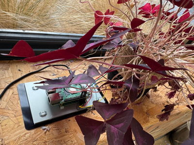
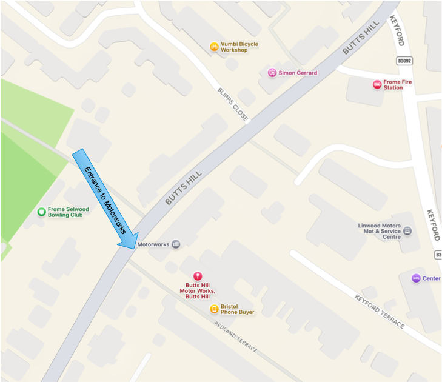

# Sam Gardner Work Experience - Information Pack

***

## Overview

**Welcome Sam!**

This information pack is intended to help you quickly orient yourself for your work experience week. We want this to be rewarding for you!

### People
- Paul Walk (who you met briefly at the College) will be your main contact and will be there everyday during the week.
- Seb Smith will be there on Tuesday, Thursday and Friday and will work with you on technical infrastructure aspects
- Helen Johnstone will be there on Monday and Wednesday. Helen represents a local charity for which Antleaf is doing some *pro bono* work to help develop and host their website

### Work
There will be three types of work during the week:

1. Routine Antleaf work: this will primarily involve joining Zoom calls with remote clients in project meetings. We will have a small number of these during the week. We will ask you to take notes at one or two of these.
2. Specific development project: we will give you a specific development project (see some details later in this document). The idea is that you work on this when you are not doing other things. This will take most of your time. Either Paul or Seb will be able to work with you on this.
3. Your work experience journal: You are expected by the College to keep a journal of your time and activities during the week, We assume that you have been briefed about this by the College - but, if not, we have some guidance that the College gave to us. We have scheduled 30 minutes every day for you to work on this.

### Lunch and breaks
We will eat lunch at Motorworks Monday-Thursday, so you will need to bring your own packed lunch for these days. We have a fridge, microwave and coffee/tea facilities here.

We have a relaxed working environment here, so you will be able to take tea/quick breaks when you are not actually in a meeting.

On Friday we will go into town to a cafe for lunch (Antleaf will pay for this).

### Equipment
You have said that you will bring your own Mac laptop. This is ideal - you will be familiar with your laptop which will speed up the orientation process. We will provide everything else that you will need.

## Schedule
We will operate a working day of 10:00 - 16:00 each day.

| Day           | Time          | Context                                                                                                                                                                                                                                     | Task                                                                                                                                                                                    | Supervising |
| ------------- | ------------- | ------------------------------------------------------------------------------------------------------------------------------------------------------------------------------------------------------------------------------------------- | --------------------------------------------------------------------------------------------------------------------------------------------------------------------------------------- | ----------- |
| **Monday**    | 10:00-12:00   | General orientation, introductions etc.  Meet Paul and Helen (meet Seb on Tuesday)                                                                                                                                                    | Learn where things are  Establish user accounts for necessary software/infrastructure                                                                                             | Paul        |
|               | 12:00-13:00   | Project                                                                                                                                                                                                                                     | Set up infrastructure to support project development                                                                                                                                    | Paul        |
|               | 13:00-14:00   | Lunch (bring a packed-lunch to eat at Motorworks)                                                                                                                                                                                           |                                                                                                                                                                                         |             |
|               | 14:00-15:30   | Project                                                                                                                                                                                                                                     | Discuss requirements with user-representative  Establish a project board ("kanban" to track requirements and development)                                                         | Paul        |
|               | 15:30-16:00   | Work experience journal                                                                                                                                                                                                                     | Update your work experience journal                                                                                                                                                     |             |
| **Tuesday**   | 10:00-11:00   | Meet Seb  Learning about Antleaf's infrastructure for deploying web services & websites                                                                                                                                               | Learning                                                                                                                                                                                | Seb         |
|               | 11:00-13:00   | Project                                                                                                                                                                                                                                     | Begin development                                                                                                                                                                       | Paul/Seb    |
|               | 13:00-14:00   | Lunch (bring a packed-lunch to eat at Motorworks)                                                                                                                                                                                           |                                                                                                                                                                                         |             |
|               | 14:00-15:00   | Zoom call with COAR to help establish a new Wordpress website for a new initiative there called the *PRC Alliance* [Zoom Link](https://us02web.zoom.us/j/7232209651)                                                                     | Note-taking                                                                                                                                                                             | Paul        |
|               | 15:00-15:30   | Quick Zoom Call with Cottage Labs - weekly checking for "Journal Checker Tool" project                                                                                                                                                      | Probably no need for note-taking so just listen and learn!                                                                                                                              | Paul        |
|               | 15:30-16:00   | Work experience journal                                                                                                                                                                                                                     | Update your work experience journal                                                                                                                                                     |             |
| **Wednesday** | 11:00-12:00   | Zoom call with Ruhr University Bochum to discuss approach to writing automated tests for the data management system Antleaf is building for them [Zoom Link](https://us02web.zoom.us/j/83766740662?pwd=PAiaRszbEyoyX1S7UCalH5rXXM1Z4F.1) | Note-taking                                                                                                                                                                             | Paul        |
|               | 12:00-13:00   | Project                                                                                                                                                                                                                                     | Developing project                                                                                                                                                                      | Paul        |
|               | 13:00-14:00   | Lunch (bring a packed-lunch to eat at Motorworks)                                                                                                                                                                                           |                                                                                                                                                                                         |             |
|               | 14:00-16:00   | Project                                                                                                                                                                                                                                     | Developing project                                                                                                                                                                      | Paul/Seb    |
| **Thursday**  | 10:00-13:00   | Project                                                                                                                                                                                                                                     | Developing project                                                                                                                                                                      | Paul/Seb    |
|               | 13:00-14:00   | Lunch (bring a packed-lunch to eat at Motorworks)                                                                                                                                                                                           |                                                                                                                                                                                         |             |
|               | 14:00-16:00   | Project                                                                                                                                                                                                                                     | Developing project                                                                                                                                                                      | Paul/Seb    |
| **Friday**    | 10:00 - 12:30 | Deploy project to live web                                                                                                                                                                                                                  | Deploying project                                                                                                                                                                       | Seb         |
|               | 12:30-13:30   | We will go out for a quick lunch in town (Antleaf will pay)                                                                                                                                                                                 |                                                                                                                                                                                         |             |
|               | 13:30-15:00   | Complete project                                                                                                                                                                                                                            | Finish deploying project  Documentation                                                                                                                                           | Paul/Seb    |
|               | 15:00-16:00   | Debrief and completing your journal                                                                                                                                                                                                         | You feed-back to us how you think this week has gone  We feed-back to you how we think you have done  We make sure that any relevant project outputs are transferred to you | Paul/Seb    |

***

## Project
This will be a small software (web application) development project. We are going to start with an intentionally vague "brief". From this you will learn a little about:

- eliciting clearer requirements from the user
- (briefly) documenting the requirements in way that allows you to convert them into clear and "actionable" tasks
	- we will develop a project board ("kanban") for this
- establishing suitable infrastructure and a development environment
- developing in an open and iterative way

### Project Brief
We have a soil-moisture sensor which takes hourly measurements from the soil of a plant in the office.

The hourly readings are sent to and collected in a [Google Sheet](https://docs.google.com/spreadsheets/d/1wz5gZ2TaHvzxDfvdOJxpuQ0dyAo7iCLEBKRFj87oJAY/edit?gid=0#gid=0), and these are then automatically made available in a [machine-readable form (CSV)](https://docs.google.com/spreadsheets/d/e/2PACX-1vTlrhEjK7N8t5rG0kyddsc40PY5xdliOVsMsoMq0Nd-CQ554JfyIcqpHbAHhOfnZvJuSiS3jD7agyEr/pub?gid=0&single=true&output=csv)

We would like to find a way to make this data available in a web page, presented in a more "human-friendly" way. It could be as simple as presenting the data, sorted by date, in a nice and browse-able way. Or we could be more ambitious and find a way to present the data in a graph.
In any case, we will discuss requirements and possibilities when we meet on Monday.

### Checklist
You will need the following to complete this project (we will assist with this on the first day):

- [ ] GitHub account
- [ ] GitHub repository
- [ ] Git installed on laptop
- [ ] Python installed on laptop
- [ ] An IDE or text editor suitable for Python development

***

## Appendices

### Quick Reference

#### Contact
Paul Walk
paul@antleaf.com
07812510001

#### Office
Studio M4
Motorworks
Frome
BA11 1HS

### About Antleaf

Formed in 2017, Antleaf is a digital consultancy working in the higher-education and research domains, with particular expertise in scholarly communications, repositories and related infrastructure, data and metadata management, and web-system design, prototyping & development.

https://antleaf.com
