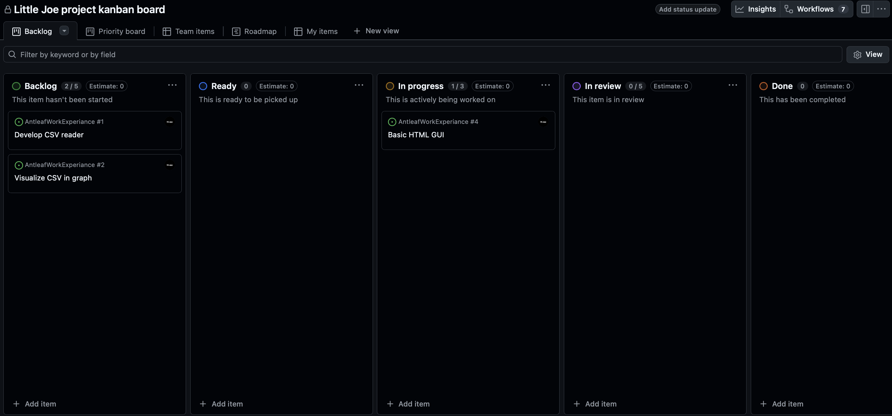

# Day one

On day one at [Antleaf](https://www.antleaf.com/) I met **Paul Walk (CEO)** who introduced and guided me through my project today. This involved making a **Kanban board** to keep track of the elemnts of my project and what stage in development they are in. 

>  

My project consists of making a dashboard to keep track of the moisture levels of Paul's potted plant - nicknamed **Little Joe**. To make this dashboard I have been given a client brief which specifies that the dashboard must include the following:

1. A human readable graph with data showing the moisture levels of the plant at give times
2. The ability to download all the plants moisture data as a CSV at the press of a button
3. The website must periodicly update
4. The website must include a image of Little Joe
5. The user must be able to know when the websites data was last updated

Today I managed to begin work on the front-end GUI and installed flask succesfuly which went well.

For tommorow I am looking forward to meeting **Seb Smith** who is Antleafs head of technical infrastructure.