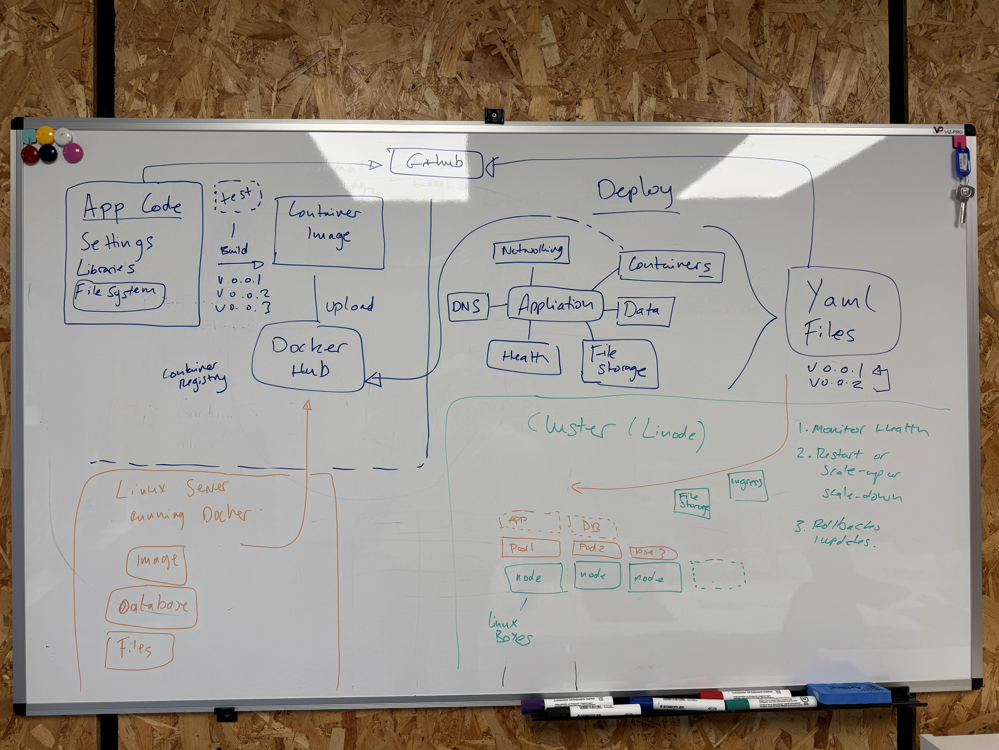

#Day two

On day two I met **Seb Smith** who walked me through this diagram (below) which explains how Antleaf deploy their websites. This diagram was highly comprehensive and covered how Antleaf utilise **Linode** to deploy their systems in pods which are children of nodes which can automaticly move pods around to distribute computational load.

>